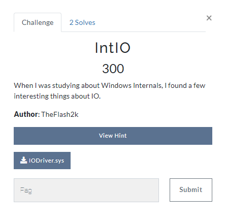
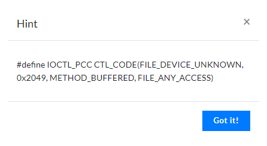
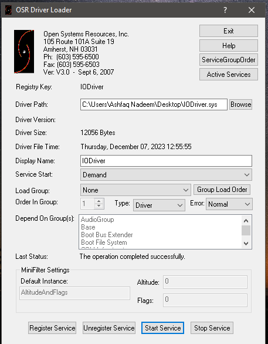
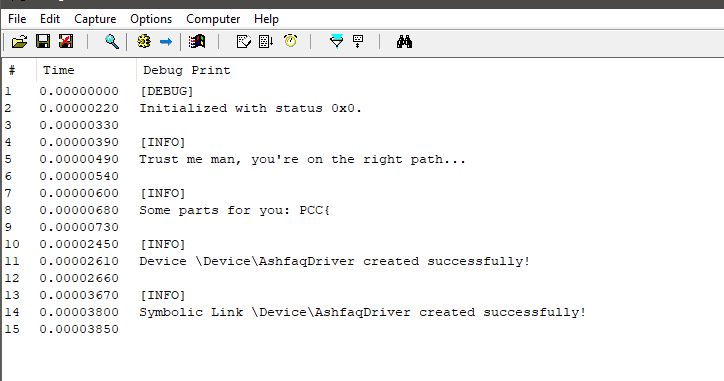
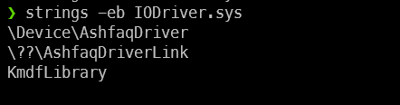
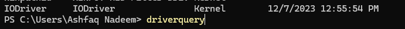
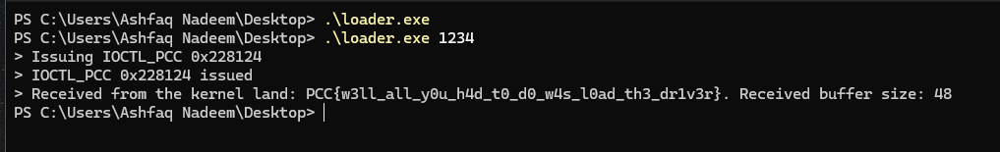
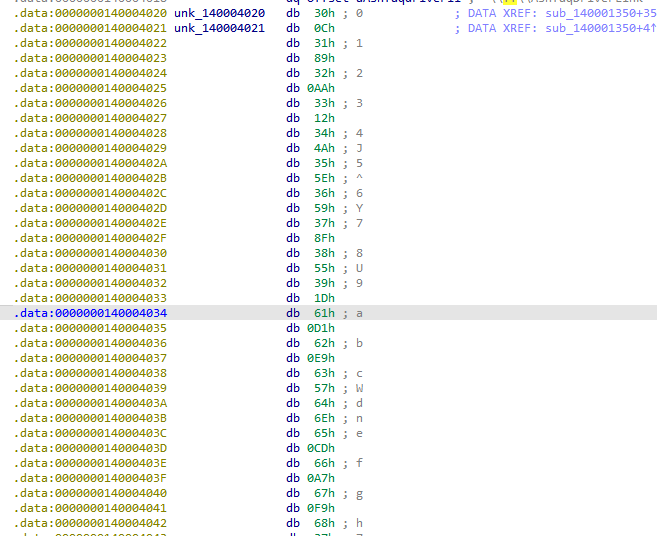
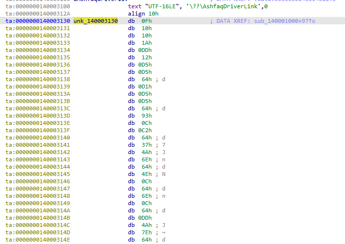
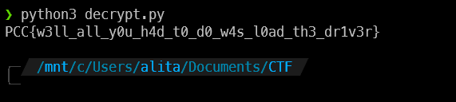

## Challenge Description



## Solution

This challenge was developed by me for the on-site finals of Pakistan Cyber Security Challenge, 2023. The attached file was a simple Windows Driver that had an encrypted flag embedded in it. However, the encryption scheme is not known. No one was able to solve it in the finals, but after finals, [72Ghoul](
https://medium.com/@hexamine22) did (and his solution was 👌). So, I'll be telling you of 3 different solutions, each with a different difficulty level.

Before moving forward, let's that a look at the provided *hint*:


Well, the hint is pretty straightforward, `IOCTL` is used to communicate with the driver from the userland. So, we might have to do some sort of communication

### Solution 1: *Load the driver*

The normal approach that I follow when reversing drivers (which is not necessarily a good approach but,) is to load the Driver and see the logs using `DebugView`. I used `OSRLoader` to load the driver.



Firstly, we registered the service and then load the service. After loading the service, we can see the logs in the `DebugView`:



Now, let's write a simple program to communicate with the driver. The program will send the `IOCTL` code to the driver and the driver will send the flag back to the userland. We will use the code from [here](https://www.ired.team/miscellaneous-reversing-forensics/windows-kernel-internals/sending-commands-from-userland-to-your-kernel-driver-using-ioctl)

Now, the code needs two things:

1. The `IOCTL` code
2. The `Device Name`

We have the IOCTL code, from the hint, however, we will have to reverse the driver to get the device name. We know that driver names have `\\\\.\\`, so, we can simply strings command in `Big-Endian` mode (as Windows Drivers' strings are UTF-16 encoded.)

```bash
strings -eb IODriver.sys
```



So now, we know that the Device name is:

```bash
\.\AshfaqDriverLink
```

Another way to identify device name is using `driverquery` command.



Now, since we know both the `IOCTL` code and the `Device Name`, we can modify the ired.team's code:

```cpp:main.cpp
#include <iostream>
#include <Windows.h>

#define IOCTL_PCC CTL_CODE(FILE_DEVICE_UNKNOWN, 0x2049, METHOD_BUFFERED, FILE_ANY_ACCESS)

int main(char argc, char ** argv)
{
    const wchar_t* deviceName = L"\\\\.\\AshfaqDriverLink";
    HANDLE device = INVALID_HANDLE_VALUE;
    BOOL status = FALSE;                 
    DWORD bytesReturned = 0;
    CHAR inBuffer[128] = {0};
    CHAR outBuffer[128] = {0};

    RtlCopyMemory(inBuffer, argv[1], strlen(argv[1]));
    
    device = CreateFileW(deviceName, GENERIC_WRITE | GENERIC_READ | GENERIC_EXECUTE, 0, 0, OPEN_EXISTING, FILE_ATTRIBUTE_SYSTEM, 0);
    
    if (device == INVALID_HANDLE_VALUE)
    {
        printf_s("> Could not open device: 0x%x\n", GetLastError());
        return FALSE;
    }

    printf_s("> Issuing IOCTL_PCC 0x%x\n", IOCTL_PCC);
    status = DeviceIoControl(device, IOCTL_PCC, inBuffer, sizeof(inBuffer), outBuffer, sizeof(outBuffer), &bytesReturned, (LPOVERLAPPED)NULL);
    printf_s("> IOCTL_PCC 0x%x issued\n", IOCTL_PCC);
    printf_s("> Received from the kernel land: %s. Received buffer size: %d\n", outBuffer, bytesReturned);

    CloseHandle(device);
}
```

> NOTE: All you needed to do was identiy the `deviceName`. The IOCTL was purposefully set to match the ired.team's code.

Once we have this, we just compiled it and ran this:



> You need to pass the data as arguments.

The challenge may look easy now as I had removed some checks about the data that came from the userland to the driver. The source code for this looked something like:

```cpp:driver.cpp
if (stackLocation->Parameters.DeviceIoControl.IoControlCode == IOCTL_PCC) {
    INFO("[0x%x] Connection with Userland successful.", stackLocation->Parameters.DeviceIoControl.IoControlCode);
    CHAR* ulData = (char*)Irp->AssociatedIrp.SystemBuffer;
    INFO("Data from userland: %s", ulData);
    Irp->IoStatus.Information = 48;
    RtlCopyMemory(Irp->AssociatedIrp.SystemBuffer, decrypt(flag, 48), 48);
    i++;
}
```

However, the previous code (which I changed to make it easier was):

```cpp:driver.cpp
if (stackLocation->Parameters.DeviceIoControl.IoControlCode == IOCTL_PCC) {
    INFO("[0x%x] Connection with Userland successful.", stackLocation->Parameters.DeviceIoControl.IoControlCode);
    CHAR* ulData = (char*)Irp->AssociatedIrp.SystemBuffer;
    INFO("Data from userland: %s", ulData);
    if(strlen(ulData) > 4) {
        if(ulData[0] == 'f' && ulData[1] == 'L' && ulData[2] == '@' && ulData[3] == 'g') {
            Irp->IoStatus.Information = 48;
            RtlCopyMemory(Irp->AssociatedIrp.SystemBuffer, decrypt(flag, 48), 48);
        }
        i++;
    }
}
```

This would've been fun and not this straightforward, but.. yeah.

### Solution 2: *Reversing the algorithm*

Now, this was the second solution, albeit slightly guessy, but yeah. So, the driver used a simple S-BOX based encryption. The S-Box looked something like this when disassembled:



Now, it was a bit-guessy but, every `n` character was shifted with the `(n+1)` character. Looking at the disassembly:

```h
.data:0000000140004020 unk_140004020   db  30h ; 0             ; DATA XREF: sub_140001350+35↑o
.data:0000000140004021 unk_140004021   db  0Ch                 ; DATA XREF: sub_140001350+4↑o
.data:0000000140004022                 db  31h ; 1
.data:0000000140004023                 db  89h
.data:0000000140004024                 db  32h ; 2
.data:0000000140004025                 db 0AAh
.data:0000000140004026                 db  33h ; 3
.data:0000000140004027                 db  12h
.data:0000000140004028                 db  34h ; 4
.data:0000000140004029                 db  4Ah ; J
```

0, which 0x30, was shifted with 0x0C, 1; which is 0x31, was shifted with 0x89, and so on. So, we now have have found the way shifting works. Let's write a simple python script. Using some basic SUBLIME-TEXT-FU, I was able to clean out all the data in no time.

```py:solve.py
sbox = "30 0C 31 89 32 0AA 33 12 34 4A 35 5E 36 59 37 8F 38 55 39 1D 61 0D1 62 0E9 63 57 64 6E 65 0CD 66 0A7 67 0F9 68 37 69 0D3 6A 63 6B 9B 6C 0D5 6D 58 6E 45 6F 0C5 70 0D6 71 4 72 0D9 73 7E 74 4E 75 0C2 76 0A5 77 0DD 78 5B 79 93 7A 84 41 0DE 42 7 43 10 44 0A 45 46 46 0B6 47 0E0 48 0D0 49 9D 4A 0A0 4B 3E 4C 50 4D 6C 4E 62 4F 8B 50 0F 51 44 52 0C1 53 1C 54 39 55 94 56 0AC 57 1E 58 0CB 59 90 5A 95 21 0FB 27 0D8 23 6 24 79 25 0B0 26 0EA 28 0E2 29 54 2A 17 2B 35 2D 11 2E 0E7 2F 26 3B 60 3C 0F4 3D 0CF 3E 2 3F 0F7 40 74 7B 1A 5C 0AF 7D 0B9 5E 96 5F 64 60 0FE 7B 9 7C 0A3 7D 5F 7E 0B7"

_ = sbox.split()
sbox = {}
for i in range(0, len(_), 2):
    sbox[int(_[i+1], 16)] = chr(int(_[i], 16))
```

Now, this is the S-BOX. Now, we need to decrypt the flag. However, we have yet to find the flag. Looking deep into the driver, we can find a weird set of hex-encoded bytes:



Now, using the above s-box, let's try and decrypt `0xf`, `0x10` and `0x10` which should correspond to `PCC`.

Seeing the `0xF` => `P` gave us hope, so I extracted all the bytes and wrote them into our `solve.py` and the final script is as follows:

```py:solve.py
flag = [0x0F,0x10,0x10,0x1A,0x0DD,0x12,0x0D5,0x0D5,0x64,0x0D1,0x0D5,0x0D5,0x64,0x93,0x0C,0x0C2,0x64,0x37,0x4A,0x6E,0x64,0x4E,0x0C,0x64,0x6E,0x0C,0x64,0x0DD,0x4A,0x7E,0x64,0x0D5,0x0C,0x0D1,0x6E,0x64,0x4E,0x37,0x12,0x64,0x6E,0x0D9,0x89,0x0A5,0x12,0x0D9,0x0B9]

sbox = "30 0C 31 89 32 0AA 33 12 34 4A 35 5E 36 59 37 8F 38 55 39 1D 61 0D1 62 0E9 63 57 64 6E 65 0CD 66 0A7 67 0F9 68 37 69 0D3 6A 63 6B 9B 6C 0D5 6D 58 6E 45 6F 0C5 70 0D6 71 4 72 0D9 73 7E 74 4E 75 0C2 76 0A5 77 0DD 78 5B 79 93 7A 84 41 0DE 42 7 43 10 44 0A 45 46 46 0B6 47 0E0 48 0D0 49 9D 4A 0A0 4B 3E 4C 50 4D 6C 4E 62 4F 8B 50 0F 51 44 52 0C1 53 1C 54 39 55 94 56 0AC 57 1E 58 0CB 59 90 5A 95 21 0FB 27 0D8 23 6 24 79 25 0B0 26 0EA 28 0E2 29 54 2A 17 2B 35 2D 11 2E 0E7 2F 26 3B 60 3C 0F4 3D 0CF 3E 2 3F 0F7 40 74 7B 1A 5C 0AF 7D 0B9 5E 96 5F 64 60 0FE 7B 9 7C 0A3 7D 5F 7E 0B7"

_ = sbox.split()
sbox = {}
for i in range(0, len(_), 2):
    sbox[int(_[i+1], 16)] = chr(int(_[i], 16))

_flag = ""
for i in flag:
    _flag += sbox[i]

print(_flag)
```



### Solution 3: *Using Unicorn to emulate* (Purely unintended)

This was the solution that [72Ghoul](https://medium.com/@hexamine22) used. He used unicorn to emulate the driver. He firstly patched the driver, and then used unicorn to emulated the patched driver. The script that he used is as follows:

```py:hexamine-solve.py
from unicorn import *
from unicorn.x86_const import *

mu = Uc(UC_ARCH_X86, UC_MODE_64)
stackaddr = 0x3000000
stack_size = 0x4000
mu.mem_map(stackaddr, stack_size)
mu.reg_write(UC_X86_REG_RSP, stackaddr + stack_size - 8 - 0x200)
mu.reg_write(UC_X86_REG_EBP, stackaddr + stack_size - 8)

global counter
counter = 0

def hook_code(uc, address, size, user_data):
    global counter
    if address == 0x1400012C1 and counter == 0:
        uc.reg_write(UC_X86_REG_RBP, uc.reg_read(UC_X86_REG_RBP) - 0x18)
        counter += 1
        
text_addr = 0x140001000

oep = 0x140001092
endaddr = 0x140001327

with open('loadedbin', 'rb') as f:
    code = f.read()
    


mu.mem_map(text_addr,0x1000000)
mu.mem_write(text_addr,code)

mu.reg_write(UC_X86_REG_RIP,oep)
mu.hook_add(UC_HOOK_CODE, hook_code)

try:
    mu.emu_start(oep,endaddr)
except UcError as e:
    print("Error: %s" % e)
    print("at : %s" % hex(mu.reg_read(UC_X86_REG_RIP)))
    
rsp = mu.reg_read(UC_X86_REG_RSP)

flag = mu.mem_read(rsp+0x70-0x58+0x18, 48)

print(flag)
```

What this code does, is that the `decrypt` function is at a constant offset, he patched the driver to jump to the `decrypt` function. Then, he emulated the driver using unicorn.

Nevertheless, this solution caught me off-guard and I was really impressed by it. So, I decided to include it in the writeup. Great job, do check out his [blog](https://medium.com/@hexamine22) as he's one of the best reversers I know.
